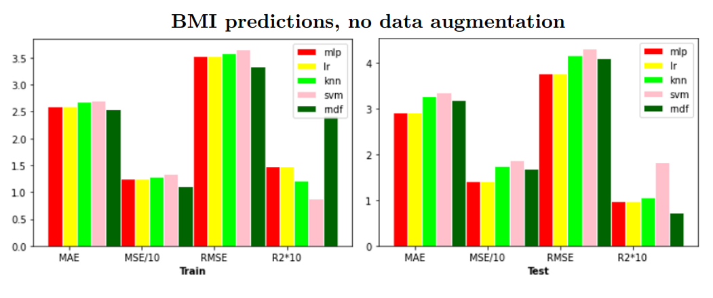
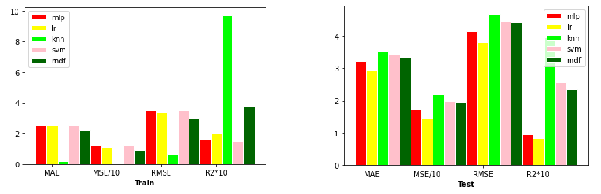
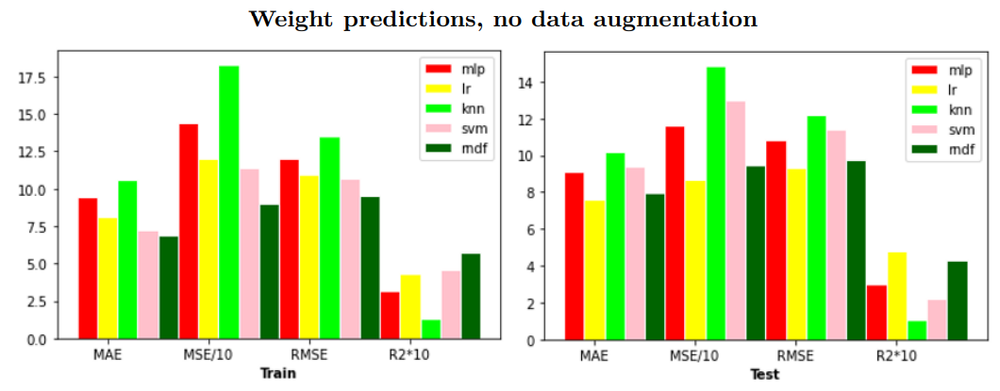
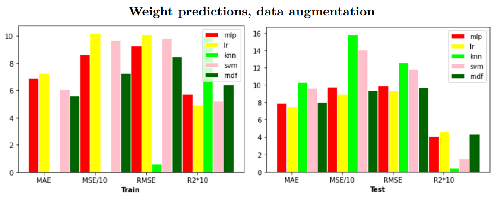

# Predicting BMI/weight from Health Indicators

This project is part of the Machine Learning Project course at **UCL Louvain University**, conducted during the academic year 2021/2022.

The main objective is to identify the most effective machine learning model for weight and BMI prediction. By leveraging a training dataset consisting of independent features, we aim to develop a model that can accurately predict weights for given individuals.
## Dataset

The dataset consists of two files:

1. X1.csv: This file contains all the feature variables. The variables include Age, Height, and several other categorical health indicators.
2. Y1.csv: This file contains the target variable - Weight.

## Project Files

The following are the main files included in this project:

- [`BMI_prediction-ToDeliver.ipynb`](https://github.com/bioshot-dotcom/BMI_weight_prediction/blob/main/BMI_prediction-ToDeliver.ipynb): Contains all the code for data preprocessing, model training, hyperparameter tuning, model evaluation, and visualization for the BMI prediction task.
- [`Weight_prediction-ToDeliver.ipynb`](https://github.com/bioshot-dotcom/BMI_weight_prediction/blob/main/Weight_prediction-ToDeliver.ipynb) : Contains all the code for data preprocessing, model training, hyperparameter tuning, model evaluation, and visualization for the weight prediction task.
- [`X1.csv`](https://github.com/bioshot-dotcom/BMI_weight_prediction/blob/main/X1.csv): Dataset file containing all the feature variables.
- [`Y1.csv`](https://github.com/bioshot-dotcom/BMI_weight_prediction/blob/main/Y1.csv): Dataset file containing the target variable.

## Methods

In this project, we explored several machine learning models to predict weights. The models tested include:

* Multi-Layer Perceptron (MLP)
* Linear Regression (LR)
* k-Nearest Neighbors (KNN)
* Support Vector Machines (SVM)
* Multivariate Decision Forests (MDF)

These models were chosen to compare their performance and determine the most suitable approach for weight/BMI prediction based on the given dataset.

## Results 

### BMI prediction without agumentation

### BMI prediction with augmentation

------------------------------------------

### Weight prediction without augmentation

### Weight prediction with augmentation

## Installation

The following libraries are required to run this code:

- pandas
- matplotlib
- numpy
- sklearn
- scipy
- seaborn

## Usage

1. The data is first imported and merged into a single DataFrame. 
2. The merged DataFrame is preprocessed by converting categorical variables into numerical, calculating the BMI from height and weight, and removing anomalies and duplicates.
3. The processed data is then split into a training set and a testing set.
4. Features are selected based on their correlation with the target variable.
5. The data is then passed to various machine learning models - Multi-Layer Perceptron Regressor (MLPRegressor), Linear Regression (LinearRegressor), K-Nearest Neighbors (KNN), Support Vector Machine (SVM), and Random Forest Regressor.
6. Hyperparameter tuning is performed on each model using GridSearchCV.
7. Each model's performance is evaluated based on Mean Absolute Error (MAE), Mean Squared Error (MSE), Root Mean Squared Error (RMSE), and R-squared (r2) metrics.
8. The performances of the models are also visualized using bar plots.

## Contributors

[Irene Rigato](https://github.com/bioshot-dotcom)

